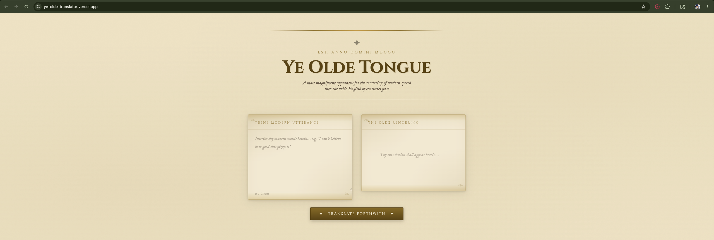
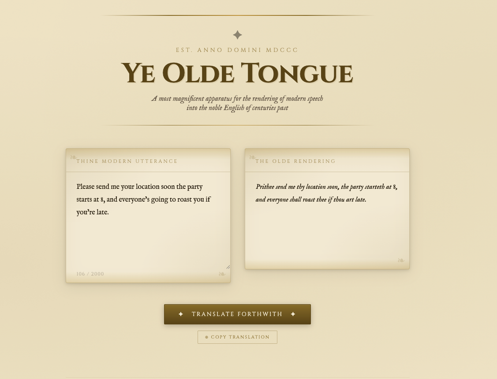
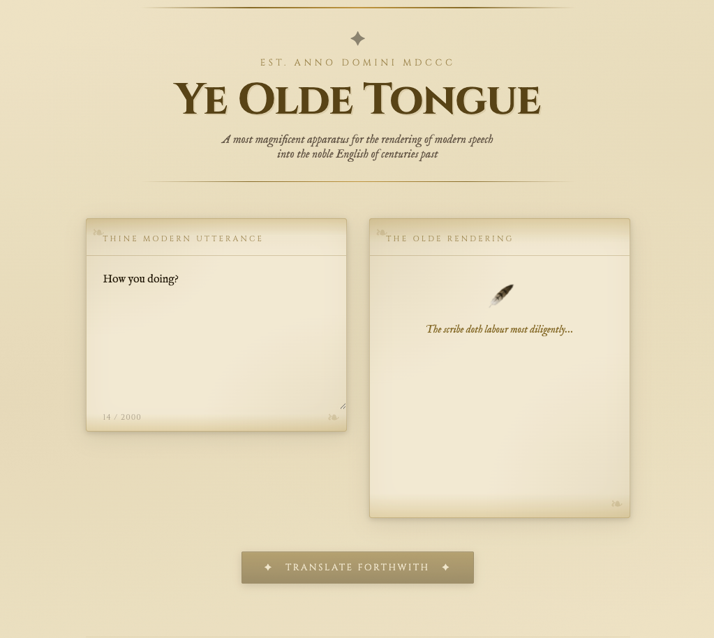

# Ye Olde Tongue 🪶

Translates modern English into authentic 1800s Victorian English using the Anthropic API.

🔗 **[Visit the site](https://ye-olde-translator.vercel.app)**

## Screenshots







## File structure

```
ye-olde-translator/
├── api/
│   └── translate.js       ← Vercel serverless function (secure proxy)
├── public/
│   ├── index.html
│   ├── style.css
│   └── script.js
├── vercel.json
├── package.json
└── .gitignore
```

## Run locally

```bash
npm i -g vercel
vercel dev
```

Runs on http://localhost:3000
Runs on http://localhost:3000
